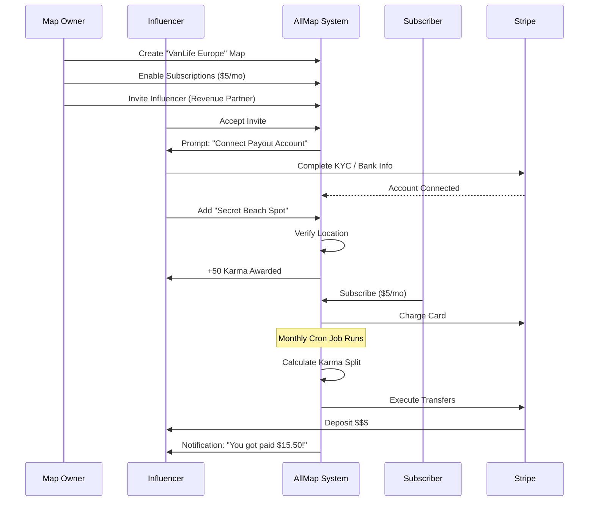

# AllMap Monetization Model Diagrams

## 1. High-Level Revenue Flow (The "Money Engine")

This diagram shows how money moves from a subscriber to the influencers' bank accounts.

```mermaid
graph TD
    %% Actors
    Subscriber((Subscriber))
    Platform[AllMap Platform]
    Owner[Map Owner / Boss]
    InfluencerA[Influencer A\n(High Contributor)]
    InfluencerB[Influencer B\n(Medium Contributor)]
    
    %% Money In
    Subscriber -- Pays $5.00/mo --> Stripe[Stripe Payment Gateway]
    
    %% The Split
    Stripe -- Processing Fee (~2.9% + 30¢) --> StripeFee[Stripe Fees]
    Stripe -- Remaining Funds --> Holding[Connect Platform Account\n(Holding Tank)]
    
    %% Platform Cut
    Holding -- 20% Platform Fee --> PlatformRevenue[AllMap Revenue]
    
    %% The Pot
    Holding -- 80% Distributable Pot --> PayoutEngine{Karma Payout Engine\n(Runs Monthly)}
    
    %% Money Out (Transfers)
    PayoutEngine -- 50% Share ($2.00) --> Owner
    PayoutEngine -- 30% Share ($1.20) --> InfluencerA
    PayoutEngine -- 20% Share ($0.80) --> InfluencerB
    
    %% Final Destination
    Owner -.-> Bank1[Owner Bank Account]
    InfluencerA -.-> Bank2[Influencer A Bank]
    InfluencerB -.-> Bank3[Influencer B Bank]
    
    style Stripe fill:#635bff,stroke:#fff,color:#fff
    style PayoutEngine fill:#f47722,stroke:#333,stroke-width:2px,color:#fff
    style PlatformRevenue fill:#00cc00,stroke:#333,color:#fff
```

## 2. The Karma Calculation Logic (The "Pie Slicer")

This diagram illustrates how the system decides *who gets what percentage* of the pot based on their contributions.

```mermaid
graph LR
    %% Inputs
    Sub[Map Subscription Revenue\n$1,000 this month]
    
    %% The Map Data
    subgraph "The Map (Total Karma = 10,000)"
        Loc1[Location 1\n(By User A, Verified)] -->|Awarded| K1[500 Karma]
        Loc2[Location 2\n(By User B, Unverified)] -->|Awarded| K2[100 Karma]
        Loc3[Location 3\n(By User A, High Quality)] -->|Awarded| K3[1,000 Karma]
        Loc4[Location 4\n(By Owner)] -->|Awarded| K4[8,400 Karma]
    end
    
    %% Aggregation
    K1 & K3 --> UserATotal[User A Total\n1,500 Karma]
    K2 --> UserBTotal[User B Total\n100 Karma]
    K4 --> OwnerTotal[Owner Total\n8,400 Karma]
    
    %% Calculation
    UserATotal -->|1,500 / 10,000| ShareA[User A Share: 15%]
    UserBTotal -->|100 / 10,000| ShareB[User B Share: 1%]
    OwnerTotal -->|8,400 / 10,000| ShareOwner[Owner Share: 84%]
    
    %% Payout
    ShareA --> PayoutA[Payout: $150]
    ShareB --> PayoutB[Payout: $10]
    ShareOwner --> PayoutOwner[Payout: $840]
    
    style UserATotal fill:#3aeddb,stroke:#333
    style ShareA fill:#3aeddb,stroke:#333
    style PayoutA fill:#3aeddb,stroke:#333
```

## 3. User Journey (UX Flow)


